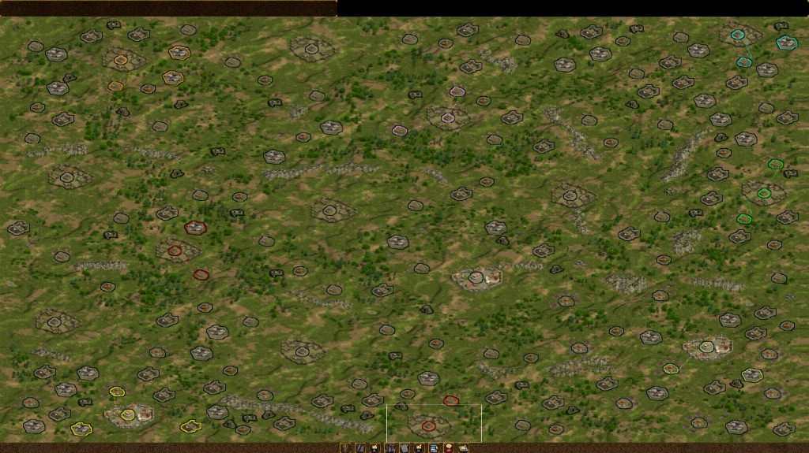
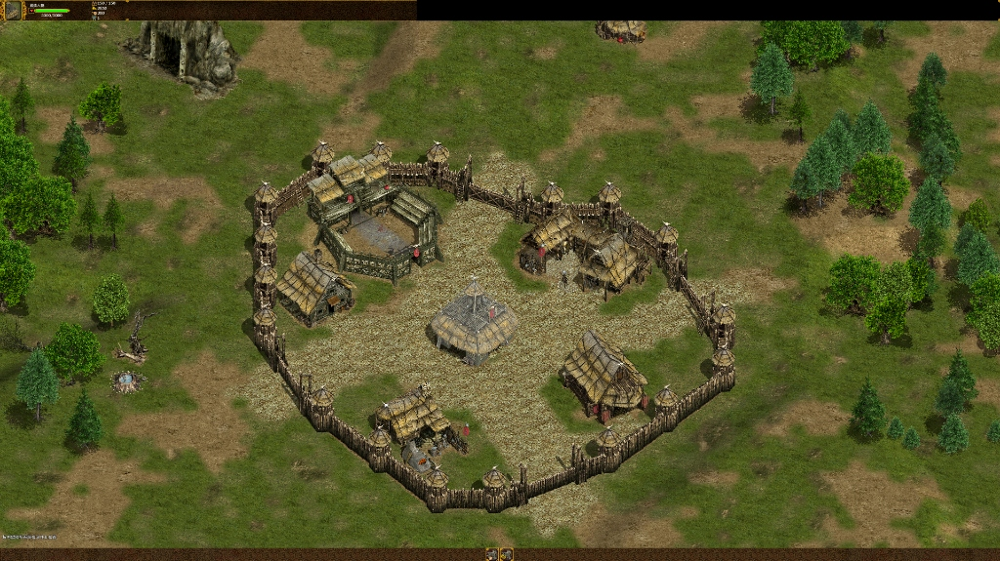
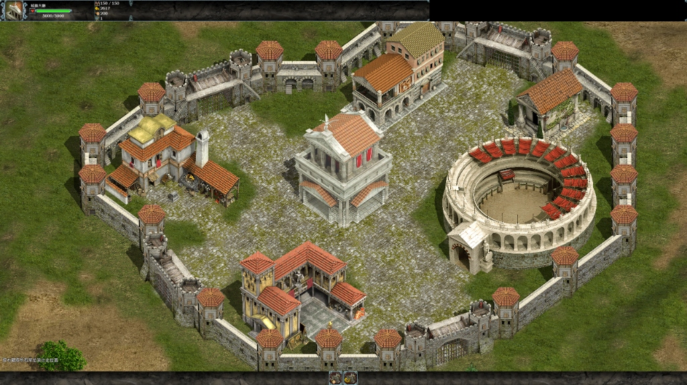
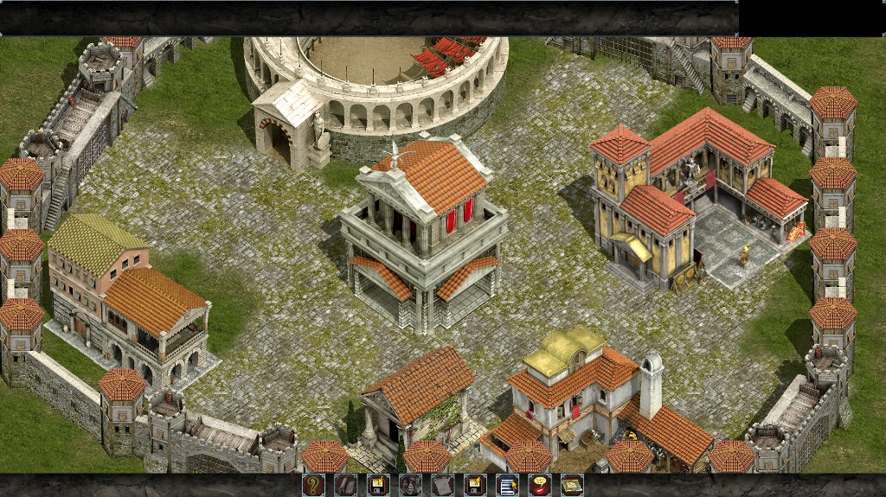
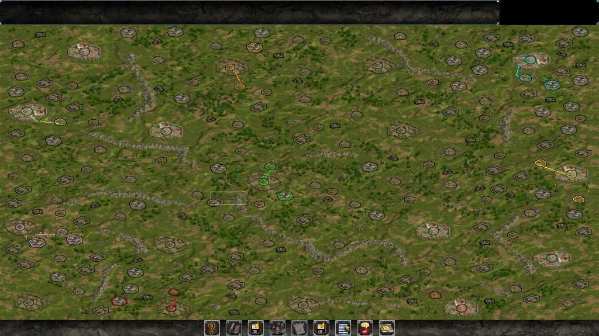
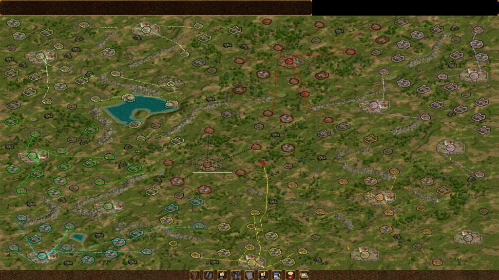

# CK-RageOfWar-Toolkit

*[繁體中文](#繁體中文) · [English](#english)*

An all-in-one performance, localization, and trainer toolkit for *Celtic Kings: Rage of War* (2004, Steam edition) — combining performance enhancements, 1080p/2K/4K high-resolution support, language pack management, and an in-depth trainer into a single, clean GUI and AI-agent-driven CLI.



---

## 繁體中文

### 這是什麼

《Celtic Kings: Rage of War》（高盧羅馬同仇錄，2004 年 Steam 版）的現代化全功能整合工具包。單一執行檔 `CKToolkit.exe` 涵蓋三大核心領域：

| 模組 | 功能特色 |
|---|---|
| **效能與相容性** | 現代 Windows 16bpp 顯示模式切換崩潰修復、大位址感知（LAA）、高解析度靜態直接修補（1080p / 2K / 4K 實機驗證穩定、零捲動塗抹破圖、直接透過 Steam 啟動；CVXVisible 32px 網格上限 4096x2400，超過一律拒絕寫入）、動畫開關、執行期崩潰攔截修復（Null-pointer 重導）、取樣分析器 |
| **多國語言包** | 內建 6 國語言包（繁體中文 zh-TW、簡體中文 zh-CN、日本語 ja-JP、Español es-ES、Italiano it-IT、Русский ru-RU，各 3,458 條詞彙 100% 覆蓋）、APF 點陣字型可逆光柵化、語言包圖形化安全匯入／匯出範本工具、可擴充任意新語言 |
| **修改器** | 17 項作弊功能（資源、人口、建築修復、部隊增益、天譴敵軍、滑鼠生成單位／裝備、循環切換、選取單位等級修改）、數十項數值平衡 Tweaks、圖形化參數設定與裝備挑選器、全鍵盤／小鍵盤自訂重對應 |

#### 實機遊戲畫面（HD 介面 / 2K / 4K 高解析度支援）

| 4K (3840x2160) 高盧要塞與村落細節 | 2K (2560x1440) 羅馬要塞城市細節 |
|:---:|:---:|
|  |  |

| HD 介面版 要塞建築細節 | HD 介面版 全景戰線視野 |
|:---:|:---:|
|  |  |

| 4K (3840x2160) 戰場全景視野 | 2K (2560x1440) 戰線全域佈局 |
|:---:|:---:|
|  |  |

> [!NOTE]
> **高解析度黑邊現象說明**：因 2004 年原廠 UI 素材並未針對 HD 以上超高解析度繪製邊界，在 2K / 4K 解析度下部分介面頂部／外緣會顯露未覆蓋的黑色留白區域（如截圖頂部所示）。此現象為原廠固定尺寸素材之正常現象，完全不影響戰場操作與遊戲運行，本工具秉持不破壞原版原則未做強行拉伸補強。

---

### 為什麼要整合成一個工具

這三套功能在過去由三個各自獨立的專案維護，在同一個遊戲目錄中會相互破壞：

1. **`data.pak` 衝突**：修改器每次從備份全量重建，會抹除效能模組附加的解析度清單；而 `vxSettings.ini` 的 `Resolution` 存的是清單**索引**，索引一旦錯位便會導致引擎異常。
2. **`Celtic kings.exe` 衝突**：效能修補與修改器都需要修改主程式，各自覆蓋導致後套用者覆蓋先套用者。
3. **備份汙染**：各工具各自備份，容易將其他工具修改過的檔案誤當成「原廠原版」存入備份。當使用者點擊「還原原版」時，拿回的反而是被污染的檔案。

整合後的工具包採用**單一套用管線**與**正規化層**，上述衝突從架構層面徹底消除。

---

### 安全性設計：零備份副本、精確反轉與正規化

本工具**不建立 `backup/` 目錄，也不複製或保存任何遊戲檔案副本**。作為 Steam 版專用工具，Steam 的「驗證遊戲檔案完整性」隨時可作為終極防線。

取代備份的機制是**精確反轉 (Exact Reversal)**：

- **逐位元組精確反轉**：每個修改均能從修補後的位元組單獨反轉回原版 Vanilla 狀態，不依賴任何外部備份檔案。
- **正規化後疊加**：每次套用均遵循「讀取現行檔案 → 反轉已偵測的本工具修補（正規化回原版）→ 依序疊加目前啟用的修補 → 一次性原子寫入」。
- **未知狀態嚴格拒絕 (Unrecognised Protection)**：若檔案被第三方未辨識工具修改或損毀，工具一律**拒絕寫入**並提示使用者先透過 Steam 驗證檔案完整性，絕不猜測。
- **零贅餘寫入**：若正規化疊加後的內容與現行檔案完全一致，嚴格跳過磁碟寫入。

---

### 系統需求與使用方法

- **系統需求**：Windows 10 / 11 (x64)、[.NET 10 Desktop Runtime](https://dotnet.microsoft.com/download/dotnet/10.0)、Steam 版《Celtic Kings: Rage of War》。
- **快速開始**：
  1. 下載最新 Release 的 `CKToolkit.exe`。
  2. 放置於任意目錄執行（不必放進遊戲目錄）。
  3. 無參數啟動即開啟 GUI 圖形介面：
     ```cmd
     CKToolkit.exe
     ```
  4. 五大分頁：**效能 / 語言 / 修改器 / 分析器 / 關於**，右上角可自由切換繁體中文／English。
  5. 勾選欲啟用的項目（如 2K 2560x1440 或 4K 3840x2160、繁體中文語言包、修改器功能）後點擊「一鍵套用」。
  6. **套用後可直接從 Steam 或桌面捷徑啟動遊戲**，2K / 4K 高解析度與所有修補均直接靜態生效，無需常駐工具！
  7. 若需還原原版，於工具中點擊「還原原版」即可逐位元組恢復原版檔案。

#### 帶診斷啟動與背景監看（選用）

工具內建 32 位元原生輔助模組 `ckperf.dll`（自動內嵌於 exe 中，磁碟零寫入）：
- **帶診斷啟動遊戲**：由工具直接啟動遊戲並注入診斷與防崩潰層。
- **掛載到執行中的遊戲**：遊戲已由 Steam 開啟時，一鍵手動掛載。
- **持續監看（Steam 開也會掛上）**：常駐背景監聽，無論何時從 Steam 開啟遊戲均會自動掛載防崩潰與遙測模組。

---

### 語言包擴充與匯出／匯入

語言包為純資料結構，新增語言無需修改任何程式碼。

#### 1. 匯出翻譯範本
點擊語言分頁的「📤 匯出翻譯範本…」或使用 CLI：
```cmd
CKToolkit.exe lang export-template --out .\my-language --template ENGLISH
```
這將自動從 `local.pak` 萃取官方詞彙，生成標準 `pack.json`、`ui.json`、`help.json` 與戰役翻譯檔。

#### 2. `pack.json` 結構範例
```json
{
  "id": "ja-JP",
  "name": "Japanese",
  "nativeName": "日本語",
  "version": "1.0.0",
  "gameLangFolder": "JAPANESE",
  "gameLangKey": "japanese",
  "templateLang": "GERMAN",
  "font": {
    "face": "Meiryo",
    "fallbackFaces": ["MS Gothic"],
    "ranges": ["3000-303F", "3040-309F", "30A0-30FF", "FF01-FF5F"]
  },
  "files": {
    "ui": "ui.json",
    "help": "help.json",
    "campaigns": ["campaign-tutorial.json"]
  }
}
```

> **`gameLangFolder` 不可與遊戲原廠語系撞名**（`ENGLISH`、`GERMAN`、`FRENCH`、
> `BULGARIAN`、`SPANISH`、`ITALIAN`、`RUSSIAN`）。撞名的話安裝會覆蓋原廠翻譯，
> 而反安裝會把原廠檔案一併刪除，導致無法還原。若要為遊戲已支援的語言提供
> 替代翻譯，請加上後綴，例如 `SPANISH_CK` —— 本工具內建的 es-ES / it-IT / ru-RU
> 就是這樣做的，遊戲原廠的西班牙文／義大利文／俄文因此完整保留，兩種都能選。
> 工具會在載入 `pack.json` 時直接拒絕撞名的語言包。

#### 3. 匯入語言包
點擊語言分頁的「📥 匯入語言包…」選取資料夾，或透過 CLI：
```cmd
CKToolkit.exe lang import --src .\my-language [--overwrite]
```
工具會自動進行路徑穿越驗證與安全 Staging 原子安裝。

---

### 修改器功能清單

修改器支援 17 項作弊功能與數十項數值平衡調整：

- **資源與內政**：黃金補滿、食物補滿、人口提升、忠誠度全滿、快速生產。
- **戰鬥與部隊**：部隊完全治療、全軍戰鬥增益、修復建築物、天譴敵軍。
- **視野與探索**：地圖全開、迷霧開關。
- **單位與物品生成**：
  - **滑鼠生成單位 (`spawn_unit`)**：在游標位置叫出指定部隊，可設定生成數量、等級（Lv.1~100）及攜帶裝備。
  - **切換生成單位 (`cycle_unit`)**：熱鍵循環切換當前生成兵種。
  - **滑鼠生成物品 (`spawn_item`)**：在游標位置生成地面皮袋，收錄全遊戲 23 種可穿戴物品／神器。
  - **切換生成物品 (`cycle_item`)**：熱鍵循環切換當前生成物品。
- **選取單位等級修改 (`set_selected_level`)**：直接將目前選取之單位或英雄部隊設定為指定等級（Lv.1~1000）。
- **圖形化參數設定對話框**：提供整齊對齊的兵種挑選器、全裝備屬性說明（如王者腰帶、狂亂皮手套、專注之石等）與一鍵神裝推薦組合。
- **鍵盤配置**：支援標準鍵盤與九宮格小鍵盤 (Numpad) 專屬獨立鍵位配置。

---

### 給 AI 代理與自動化腳本的 CLI

CLI 專為 AI 代理程式與自動化管線設計，所有指令永不互動、永不彈窗，並支援結構化 JSON 輸出：

```cmd
CKToolkit.exe status  [--json]              檢查遊戲狀態與已套用的修補
CKToolkit.exe apply   [--json]              依設定套用所有修補
CKToolkit.exe restore --all [--json]        反轉所有修補回到原版
CKToolkit.exe verify  [--json]              唯讀驗證現行檔案（零寫入）
CKToolkit.exe perf get|set ...              效能與 HD 解析度設定
CKToolkit.exe lang list|install|uninstall|import|export-template ...
CKToolkit.exe trainer list-cheats|list-tweaks|set|apply ...
CKToolkit.exe profile --seconds <n> --hz <n> --out <file>
CKToolkit.exe run [--plain|--watch|--attach] 帶診斷執行或掛載遊戲
CKToolkit.exe --game <dir>                  覆寫遊戲目錄（全域參數）
```

結構化 JSON 封套範例：
```json
{
  "ok": true,
  "command": "status",
  "data": { ... },
  "warnings": [],
  "errors": []
}
```

- **標準退出碼**：`0` 成功、`1` 一般失敗、`2` 參數錯誤、`3` 找不到遊戲目錄、`4` 檔案狀態無法辨識（需 Steam 驗證）、`5` 檔案被佔用中。

---

### 從原始碼建置與測試

```cmd
dotnet build CKToolkit.sln -c Release
dotnet run --project src/CKToolkit.SelfTest/CKToolkit.SelfTest.csproj -c Release
```

若欲使用真實的原版遊戲檔案進行 APF 字型往返、目錄排序等深度驗證，可設定環境變數：
```cmd
set CKTOOLKIT_VANILLA_DIR=C:\Path\To\VanillaGame
```

---

### 授權與致謝

- 本專案採用 **MIT License** 開源授權。
- 繁體中文翻譯資料由 [nojackno2-ctrl](https://github.com/nojackno2-ctrl) 製作維護。
- 本工具為社群獨立開發之非官方工具，與 Haemimont Games 及遊戲發行商無關，儲存庫內不包含任何原版遊戲之受版權保護二進位檔案。

---

## English

### What this is

An all-in-one modernization and toolkit for *Celtic Kings: Rage of War* (2004, Steam edition). A single executable `CKToolkit.exe` covers three essential domains:

| Module | Features |
|---|---|
| **Performance & Compatibility** | Fixes 16bpp mode-switch crashes on modern Windows, Large Address Aware (LAA), High-Resolution static direct patching (1080p / 2K / 4K verified stable with zero scrolling artifacts, launchable directly via Steam; the CVXVisible 32px grid tops out at 4096x2400 and anything larger is refused), animation toggles, runtime crash interceptor (null-pointer redirection), sampling profiler |
| **Language Packs** | Six built-in language packs (zh-TW, zh-CN, ja-JP, es-ES, it-IT, ru-RU — 3,458 entries each, 100% coverage), reversible APF bitmap font rasterization, GUI-based safe import/export template tools, extensible to any new language |
| **Trainer** | 17 cheat features (resources, population, instant build, godmode heal/buff, smite enemies, spawn units/items at cursor, hotkey cycling, selected unit level modifier), dozens of balance tweaks, visual parameter dialog with item picker, full keyboard / Numpad remapping |

#### In-Game Screenshots (HD UI / 2K / 4K High-Resolution Support)

| 4K (3840x2160) Celtic Settlement Detail | 2K (2560x1440) Roman Fortress Detail |
|:---:|:---:|
|  |  |

| HD Interface - Settlement Detail | HD Interface - Panoramic Battlefield |
|:---:|:---:|
|  |  |

| 4K (3840x2160) Battlefield Panoramic View | 2K (2560x1440) Tactical Battlefield Layout |
|:---:|:---:|
|  |  |

> [!NOTE]
> **Note on High-Resolution Black Borders**: Because original 2004 game UI assets were not designed for ultra-high resolutions above standard HD, black uncovered areas may appear along certain top/outer screen edges (as visible in the top headers of the screenshots above). This is purely cosmetic from fixed-dimension legacy UI assets and does not affect tactical battlefield controls or gameplay stability; the toolkit intentionally leaves them unstretched to preserve original asset integrity.

---

### Why one tool instead of three

Previously, these features were maintained in three separate utilities, which corrupted each other when targeting the same game directory:

1. **`data.pak` conflicts**: The trainer rebuilt the pak from its internal backup, wiping resolution entries appended by the performance patcher. Because `Resolution` in `vxSettings.ini` is an *index* into that list, it silently broke engine resolution lookup.
2. **`Celtic kings.exe` conflicts**: Both the performance patcher and the trainer edited the executable, each overwriting the other depending on which ran last.
3. **Backup pollution**: Each tool kept its own backup, inadvertently saving another tool's modified file as "vanilla". Clicking "restore original" resulted in restored files that were corrupted or altered.

The unified toolkit uses a **single application pipeline** and **normalization layer**, eliminating cross-tool conflicts by design.

---

### Safety Model: Zero Backups, Exact Reversal & Normalization

This tool **does not create a `backup/` directory and never stores copies of game files**. Because this is a Steam-specific tool, Steam's built-in "Verify integrity of game files" serves as the definitive safety net.

Backups are replaced by **Exact Reversal**:

- **Byte-Exact Reversal**: Every modification can be reversed from the patched bytes back to vanilla without external copies.
- **Normalize-then-Apply**: Every operation reads the live file, reverses all detected toolkit patches (normalizing back to vanilla), layers the requested settings, and performs a single atomic write.
- **Unrecognised Protection**: Files modified by third-party tools or corrupted are **refused outright**, prompting the user to verify files via Steam.
- **Zero Unnecessary Writes**: If normalized and reapplied bytes are identical to live bytes, disk writes are skipped entirely.

---

### Requirements & Usage

- **Requirements**: Windows 10 / 11 (x64), [.NET 10 Desktop Runtime](https://dotnet.microsoft.com/download/dotnet/10.0), Steam edition of *Celtic Kings: Rage of War*.
- **Quick Start**:
  1. Download `CKToolkit.exe` from the latest Release.
  2. Run from anywhere (does not need to be placed inside the game folder).
  3. Running with no arguments opens the GUI:
     ```cmd
     CKToolkit.exe
     ```
  4. Five tabs: **Performance / Language / Trainer / Profiler / About**, with a Traditional Chinese / English toggle in the top-right corner.
  5. Select desired options (e.g. 2K 2560x1440 or 4K 3840x2160, Traditional Chinese language pack, Trainer options) and click "Apply".
  6. **Launch directly from Steam or standard shortcut** — 2K/4K and all patches are statically applied to game files, no background utility needed!
  7. Click "Restore" at any time to return all files to byte-exact vanilla.

#### Diagnostics & Background Watcher (Optional)

Includes an embedded 32-bit native runtime helper `ckperf.dll` (embedded in the exe, zero disk footprint):
- **Launch Game with Diagnostics**: Launches the game and injects crash prevention and telemetry hooks before the entry point.
- **Attach to Running Game**: Attach diagnostic and recovery layers to an already running instance.
- **Watch & Auto-Attach**: Background watcher that automatically hooks into game instances launched directly from Steam.

---

### Language Pack System

Language packs are purely data-driven. Adding a new language requires zero code changes.

#### 1. Export Translation Template
Click "📤 Export Template..." in the Language tab or run via CLI:
```cmd
CKToolkit.exe lang export-template --out .\my-language --template ENGLISH
```

#### 2. `pack.json` Structure Example
```json
{
  "id": "ja-JP",
  "name": "Japanese",
  "nativeName": "日本語",
  "version": "1.0.0",
  "gameLangFolder": "JAPANESE",
  "gameLangKey": "japanese",
  "templateLang": "GERMAN",
  "font": {
    "face": "Meiryo",
    "fallbackFaces": ["MS Gothic"],
    "ranges": ["3000-303F", "3040-309F", "30A0-30FF", "FF01-FF5F"]
  },
  "files": {
    "ui": "ui.json",
    "help": "help.json",
    "campaigns": ["campaign-tutorial.json"]
  }
}
```

> **`gameLangFolder` must not reuse a stock game language folder** (`ENGLISH`, `GERMAN`,
> `FRENCH`, `BULGARIAN`, `SPANISH`, `ITALIAN`, `RUSSIAN`). Installing into one overwrites
> the original translation, and uninstalling then deletes the stock files along with ours,
> making the pack unrevertible. To ship an alternative translation for a language the game
> already supports, add a suffix — e.g. `SPANISH_CK`, which is exactly what the built-in
> es-ES / it-IT / ru-RU packs do. The game's own Spanish/Italian/Russian stay intact and
> both remain selectable. Packs that collide are rejected when `pack.json` is loaded.

#### 3. Import Language Pack
Click "📥 Import Pack..." in the Language tab, or via CLI:
```cmd
CKToolkit.exe lang import --src .\my-language [--overwrite]
```

---

### Trainer Feature Overview

Supports 17 cheats and dozens of gameplay balance tweaks:

- **Economy & Base**: Fill Gold, Fill Food, Population Boost, Max Loyalty, Instant Production.
- **Combat & Armies**: Heal Army, Buff Army, Repair Buildings, Smite Enemies.
- **Vision**: Reveal Map, Toggle Fog.
- **Unit & Item Spawning**:
  - **Spawn Unit (`spawn_unit`)**: Spawn chosen units at cursor with custom count, level (1–100), and equipment loadout.
  - **Cycle Unit (`cycle_unit`)**: Hotkey to cycle through available unit types.
  - **Spawn Item (`spawn_item`)**: Spawn item bags at cursor containing any of the 23 game items / artifacts.
  - **Cycle Item (`cycle_item`)**: Hotkey to cycle through available items.
- **Set Selected Unit Level (`set_selected_level`)**: Instantly set the selected unit or hero army to any level (1–1000).
- **Graphical Parameter Dialog**: Clean 3-column aligned grid with item ability descriptions and recommended gear presets (Godly Gear, Max ATK, Max DEF).
- **Key Remapping**: Comprehensive keyboard and Numpad key binding support.

---

### CLI for AI Agents & Automation

Designed specifically for AI coding agents and automated pipelines. Non-interactive, no prompts, stable `--json` envelope:

```cmd
CKToolkit.exe status  [--json]              Check game state and applied patches
CKToolkit.exe apply   [--json]              Apply configured patches
CKToolkit.exe restore --all [--json]        Normalize and restore files to vanilla
CKToolkit.exe verify  [--json]              Read-only verification (zero writes)
CKToolkit.exe perf get|set ...              Performance & resolution settings
CKToolkit.exe lang list|install|uninstall|import|export-template ...
CKToolkit.exe trainer list-cheats|list-tweaks|set|apply ...
CKToolkit.exe profile --seconds <n> --hz <n> --out <file>
CKToolkit.exe run [--plain|--watch|--attach] Launch or attach with diagnostics
CKToolkit.exe --game <dir>                  Override game directory (global flag)
```

JSON output envelope format:
```json
{
  "ok": true,
  "command": "status",
  "data": { ... },
  "warnings": [],
  "errors": []
}
```

- **Exit Codes**: `0` Success, `1` General Failure, `2` Invalid Arguments, `3` Game Not Found, `4` Unrecognised File State (run Steam verify), `5` File Locked.

---

### Building and Testing

```cmd
dotnet build CKToolkit.sln -c Release
dotnet run --project src/CKToolkit.SelfTest/CKToolkit.SelfTest.csproj -c Release
```

To validate format handling against authentic game files, set the environment variable:
```cmd
set CKTOOLKIT_VANILLA_DIR=C:\Path\To\VanillaGame
```

---

### Licence & Credits

- Released under the **MIT License**.
- Traditional Chinese localization created and maintained by [nojackno2-ctrl](https://github.com/nojackno2-ctrl).
- This is an unofficial community project not affiliated with Haemimont Games or the publisher. No copyrighted game binaries are distributed in this repository.
